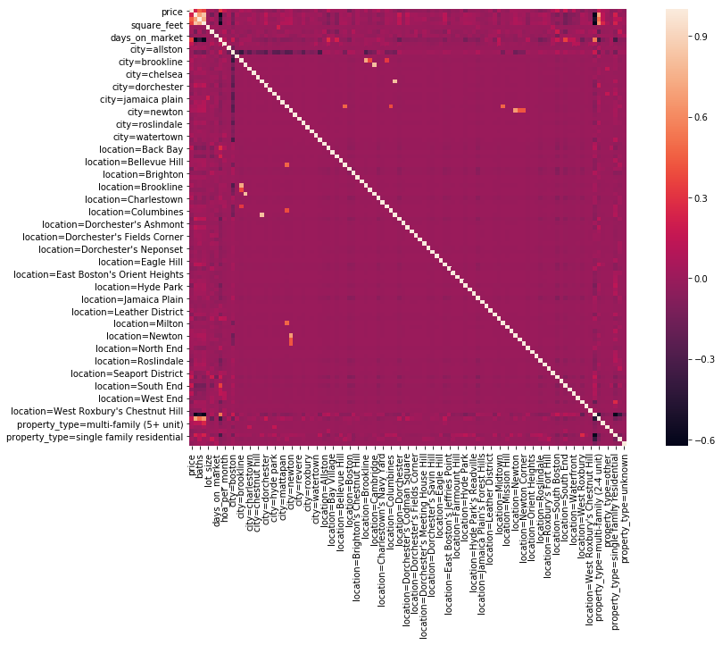
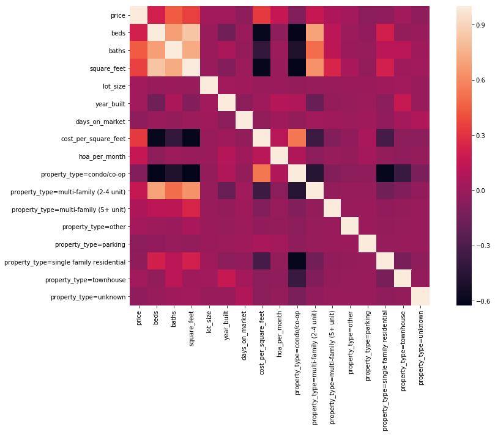
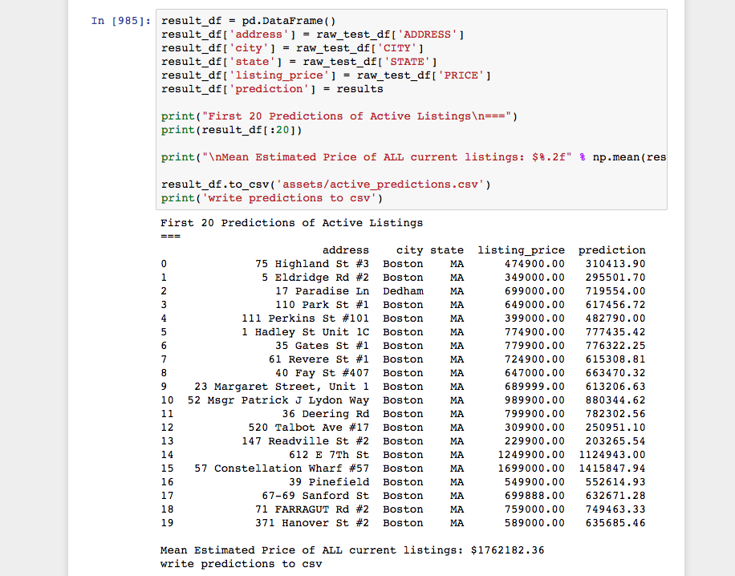
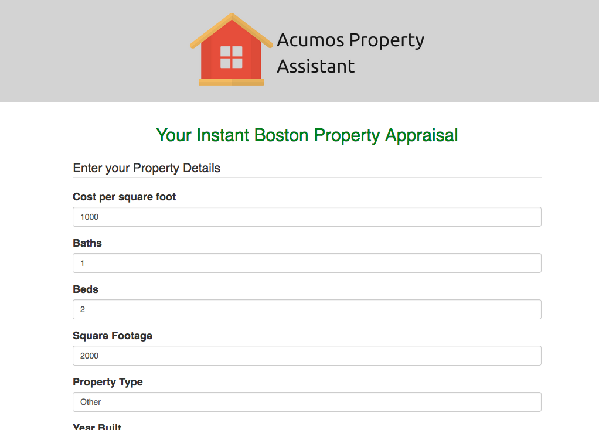
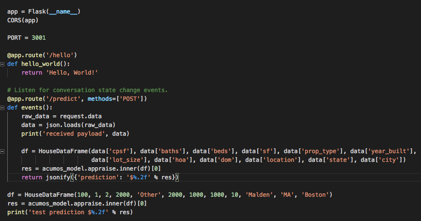
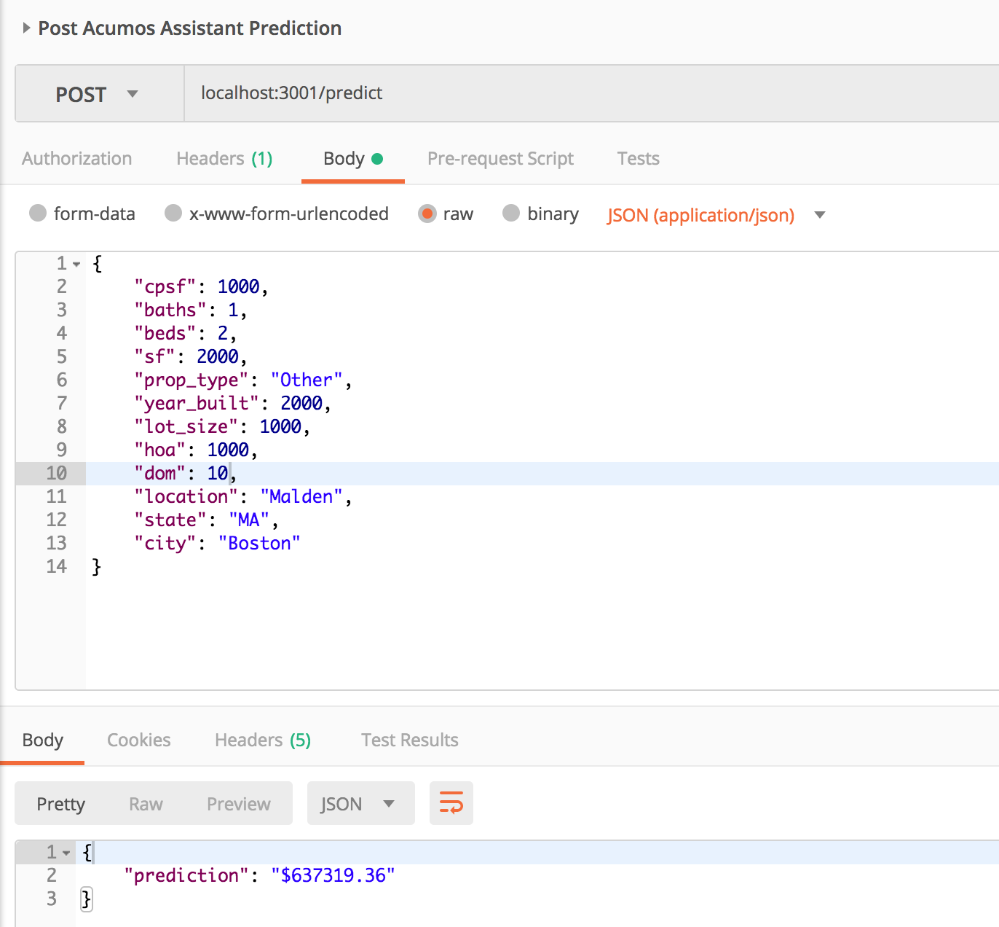
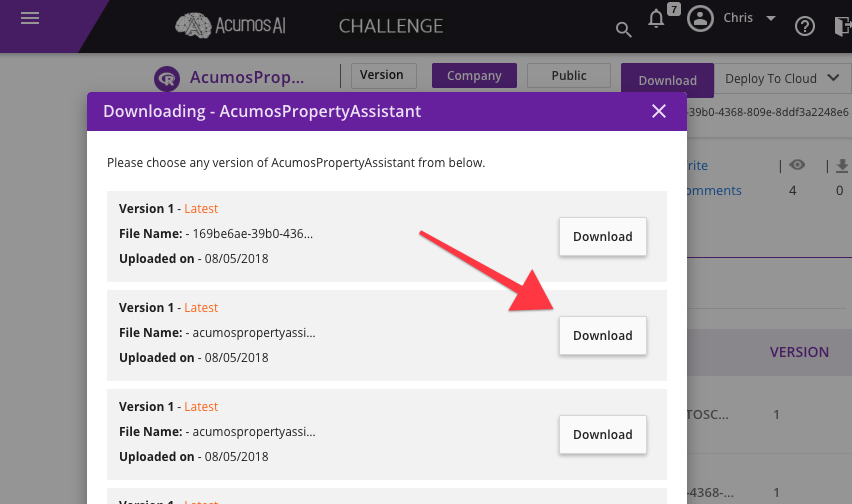

    

Acumos Property Assistant
---

A python-powered machine learning model for determining the valuation of your property - powered by Acumos, Redfin, and sklearn.

This model is already trained on the Boston recently-sold properties in the `assets` folder. Recommend retraining if you want to run the model in your own area.

## Concept

Many real estate agents follow a notion of comps (or comparables) when pricing a home. Problem here is that this is often subject to an individual realtors' biases and often only looks at 2-3 properties in the area as a comparison. There are also many real estate websites (such as Zillow, Redfin, and Trulia) that do property valuations; however, the exact details that go into their pricing models are unclear. This program provides a simple open-source solution that can be easily extended for more niche property value modeling.

The Acumos Property Assistant is a machine learning model deployed on the Acumos store for pricing your home based on fundamental property characteristics.

More specifically, we survey the intrinsic properties of a home, such as number of bathrooms, number of bedrooms, square footage, and location, as sampled from the Redfin website (www.redfin.com), and allow users to price their home using a large dataset of collected properties.

By no means is this an exhaustive model, but should give users as idea of what their home (or someone else's home) is at worth in the current market.

## Usage

The model expects a dataframe of properties (containing the following list of entries) in the following format:

<pre>
[
    ('cost_per_square_feet', List[str]), 
    ('baths', List[str]), 
    ('beds', List[str]), 
    ('square_feet', List[float]), 
    ('property_type', List[float]), 
    ('year_built', List[float]), 
    ('lot_size', List[str]), 
    ('hoa_per_month', List[float]), 
    ('days_on_market', List[float]), 
    ('location', List[float]), 
    ('state', List[float]), 
    ('city', List[float])
]
</pre>

#### Definitions:
* Cost units in USD.
* `hoa_per_month`: Home Owner Association Fees per month
* `location`: city district
* `property_type`: One of the following:

<pre>
{
    'Condo/Co-op',
     'Multi-Family (2-4 Unit)',
     'Multi-Family (5+ Unit)',
     'Other',
     'Parking',
     'Single Family Residential',
     'Townhouse',
     'Unknown'
}
 </pre>

See `test_data.csv` for an example input, and `predictions.csv` for the example output in the assets folder as an example.

The model on Acumos is currently trained on Boston housing data over the last 3 months, but could easily be retrained to other cities and locations.

## Correlations of Property Features

#### Full Correlation (All property features and locations/cities).

    

#### Partial Correlation (Quantitative metrics only)

    

#### Running the Model

    

### Deployment

    

A sample web app is contained within the folder `acumos-assistant`. This app uses the live model to return a price assessment
of the user's property based on the provided values.

The model is encapsulated within the acumos_model picked object.

<pre>
    df = HouseDataFrame(100, 1, 1, 1000, 'Other', 2000, 1000, 1000, 10, 'Malden', 'MA', 'Boston')
    res = pd.DataFrame([df], columns=HouseDataFrame._fields)
    acumos_model.appraise.inner(df)
    print("$%.2f" % predict(res)[0])

    # Output:
    $421995.04

</pre>

The Acumos Property Assistant is contained and can be exported for use in any project.
I have configured a live example server that you can run in the file `server.py`. Simply install the dependencies and run this on the command line via `python3 server.py`.

    

You can query the model via a standard post request.

    

You now have a live server hosting and running the Acumos Property Assistant! You can use this to get property values in any live app!

    

#### Running in docker

This container is also usable via docker by downloading the tar file from the Acumos community.

    

<pre>
    docker load -i acumospropertyassistant_169be6ae-39b0-4368-809e-8ddf3a2248e6_2.tar     
    docker images # find your container
    docker run -p 3330:3330 {CONTAINER_ID}
</pre>

This will now expose the port for invocation with the named tuple via the `appraise` method.

Documented here: https://docs.acumos.org/en/latest/AcumosUser/portal-user/dev-challenge-getting-started.html

#### Project Details
- [x] Written description of the Submission (must be in English)
- [ ] Summary Video (Must be in English) = 
- [x] Sample input dataset - `assets/test_data.csv`
- [x] Sample dataset produced by the Submission - `assets/active_predictions.csv`
- [x] Sample application for testing the Submission - Run the ipynb or deployed Acumos model
- [x] Documentation (“Documentation”) explaining how to deploy the Submission,
how to deploy the demonstration of the Submission, and all supporting toolkits
and programming languages. 
