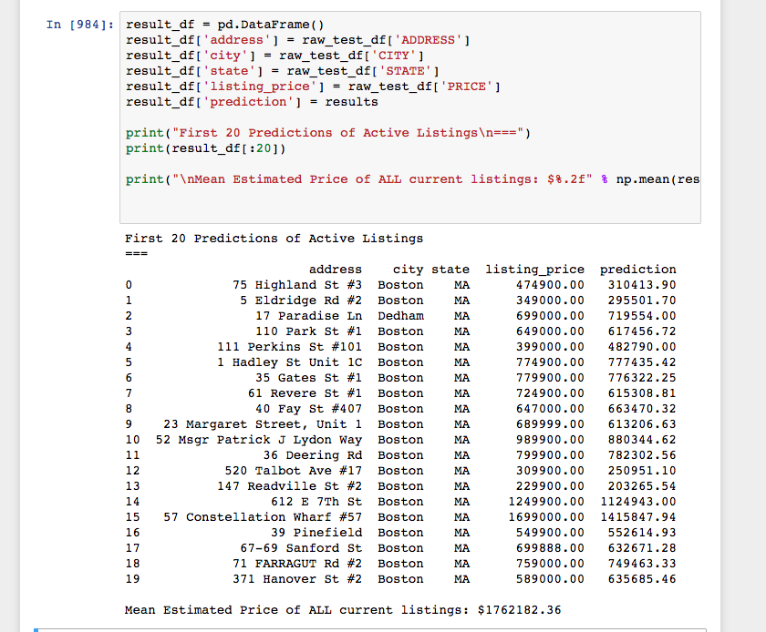

    

Acumos Property Assistant
---

A python-powered machine learning model for determining the valuation of your property - powered by Acumos and sklearn.

This model is already trained on the Boston recently-sold properties in the `assets` folder. Recommend retraining if you want to run the model in your own area.

### Usage

The model expects a dataframe of properties to value in the following format.

### Correlations of Property Features

#### Full Correlation (All property features and locations/cities).

    

#### Partial Correlation (Quantitative metrics only)

    

#### Running the Model

    

